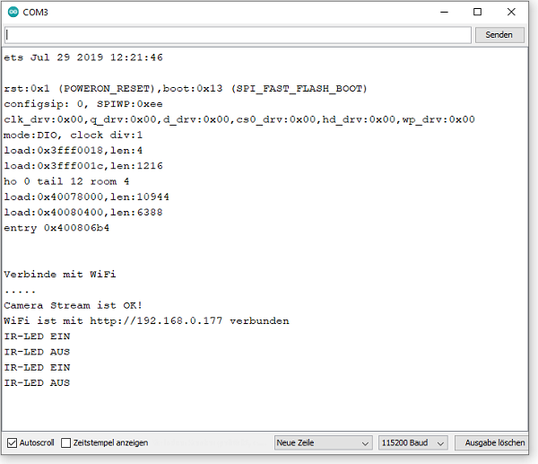
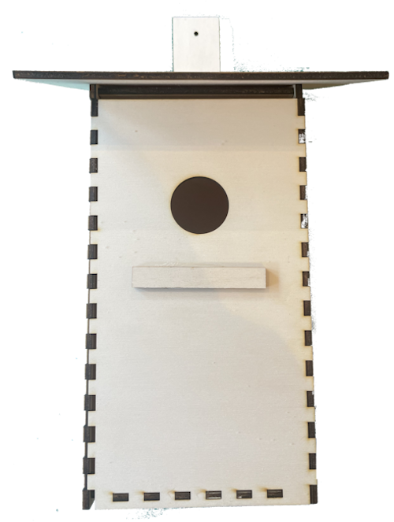

# Bird watching 
### Nach einer Idee von [Alex Kutschera](https://github.com/vektorious)

### Story
Die Blaumeise und die Kohlmeise gehören zu den häufigsten Meisenarten in Deutschland. Sie gehen nicht nur gerne an Futterhäuschen, sondern suchen auch Nistkästen auf, in denen sie Schutz suchen und ihre Familie gründen können. Für jede Vogelart gibt es eine ideale Größe des Einfluglochs. Bei den kleinen Blaumeisen sind das 28 Millimeter Durchmesser, bei den größeren Kohlmeisen 32 und beim Star 45mm Lochgröße. Die Lightburnvorlage ist für Kohlmeisen ausgelegt.  Das Einflugloch sollte in Richtung Ost / Südost ausgerichtet sein. 

Die Kohlmeise ist ein kleiner Singvogel. Sie hat einen schwarzen Kopf, weiße Wangen und gelbes Gefieder an Brust und Bauch, sie sind etwa 11 bis 12 Zentimeter groß und wiegen zwischen 9 und 12 Gramm. Mit der CAM des ESP32 und dem WEB-Server kann man in den Nistkasten das Schlüpfen der Jungvögel beobachten. Die 4 IR-LEDs lassen sich über den WEB-Server ein/aus schalten. Der WEB-Server hat eine feste IP-Adresse: 192.160.0.177. Um den WiFi-Empfang des ESP zu verbessern, wurde die Antenne des ESP32-CAM mit 20cm Blankdraht verlängert. In der Testphase ist mit dem Serielllen Monitor die WiFi-Verbindung und die Schaltvorgänge der IR-LEDs zu kontrollieren. Für die Spannungsversorgung ist ein 5V-Netzteil vorgesehen. Möglich ist auch eine Spannungsversorgung mit einem 18650 Akku, der von einem Solor-Panel gespeist wird.

---

### Der WEB-Server:

---

### Serieller Monitor:

---

### BOM

| Stück | Bezeichnung |
| ----- | ----------- | 
| 1        | ESP32 CAM      | 
| 1        | ESP32 CAM Shield    | 
| 4        | IR-LEDs 850 nm DC 1,5V 20mA   | 
| 4        | 180R 1/4W  | 
| 1        | 20cm Blankdraht  | 
| 1        | Schaltdraht      |
| 1        | 5V Netzteil |
| 1        | Vogelhaus: |
| 2        | Sperrholz 4mm 300x600 |
| ----- | ----------- | 

---

[Bauanleitung](https://github.com/frankyhub/Bird_watching/wiki)

---

---

   
<ol class="breadcrumb" style="border-top: 2px solid black;border-bottom:2px solid black; height: 45px; width: 900px;"> 
<a href="#oben">nach oben</a>
</ol>

---

